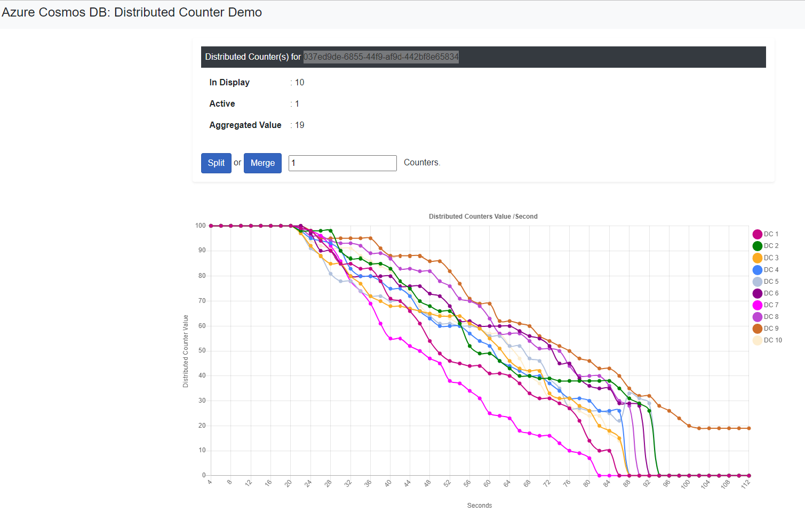

# Distributed Counter Pattern

## Description

High traffic website that keeps track of counts for a particular object such as a post or the inventory of a highly sought after product find it difficult to update the count in a single document continuously because it causes contention. Such high concurrency environments utilize distributed counters to keep track of the number, rather than reducing the same document they distribute the counter into multiple distributed counters. During a high volume updates a distributed counter is picked randomly from the pool and updated independently without the requirement of a management module. Although each distributed counter is updated independently, they collectively give the total count being tracked.

This sample demonstrates

1. Creation of multiple Distributed Counters using the value of the Primary Counter( count of products/items in inventory).
2. On Demand Splitting and Merging of the Distributed counters.
3. Calculate aggregated value of the Distributed Counters at any given time.
4. Decrementing the Distributed counters randomly using a large number of worker threads.

## Setup

- Review the [SETUP.md](source/SETUP.md) file for details on how to setup and run the sample.

## Details

The sample has three components
1. **Counter**: A class library that impments the Distributed Counter Pattern. This class library contains 2 public classes
     - **DistributedCounterManagementService**: Used to create Distributed Counter and manage on demand splitting and merging.
     - **DistributedCounterOperationalService**: Used to update the counters in a high traffic workload. The library picks a random distributed counter from thh pool of available counters and updates them using the Patch method of Azure Cosmos DB. This ensures there are no conflicts and each update is an atomic transaction.
 1. **Visualizer**:  This  Blazer app provides a UI to create Distributed Counters. It provides chart based visualization of how the counters are performing. It uses the *DistributedCounterManagementService* class from *Counter* library.

 1. **ConsumerApp**: A Console app used to mimic a high traffic workload. It creates multiple threads and each threads runs in a loop to update the Distributed Counters very fast. It uses the *DistributedCounterOperationalService* class from *Counter* library. 

## Summary

By using distributed counters in Cosmos DB, you can handle high concurrency workloads that need item counts that would otherwise be problematic and have less performance.
