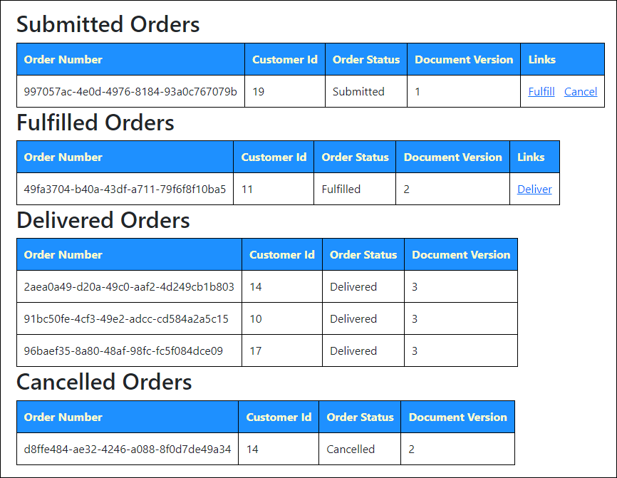

# Document versioning

Document versioning is used to track the current version of a document and store historical documents in another collection. Where schema versioning tracks the schema changes, document versioning tracks the data changes. This pattern works well when there are few document versions to be tracked.

## Why use document versioning?

Some industries have regulations for data retention that require historical versions to be retained and tracked. Auditing and document control are other reasons for tracking versions. With document versioning, the current versions of documents are stored in a collection named to store the current documents. A second collection is named to store historical documents. This improves performance by allowing queries on current versions to be polled quickly without having to filter the historical results. The document versioning itself is handled at the application layer - outside of Azure Cosmos DB.

## Sample implementation of document versioning

In this example, we will explore document versioning using orders in an eCommerce environment.

Suppose we have this document:

```json
{
    "customerId": 10,
    "orderId": 1101,
    "status": "Submitted",
    "orderDetails": [
        [{"productName": "Product 1", "quantity": 1},
         {"productName": "Product 2", "quantity": 3}]
    ]
}
```

Now, suppose the customer had to cancel the order. The replacement document could look like this:

```json
{
    "customerId": 10,
    "orderId": 1101,
    "status": "Cancelled",
    "orderDetails": [
        [{"productName": "Product 1", "quantity": 1},
         {"productName": "Product 2", "quantity": 3}]
    ]
}
```

Looking at these documents, though, there is no easy way to tell which of these documents is the current document. By using document versioning, add a field to the document to track the version number. Update the current document in a `CurrentOrderStatus` container and add the change to the `HistoricalOrderStatus` container. While Azure Cosmos DB for NoSQL does not have a document versioning feature, you can build in the handling through an application. In [the demo](./code/setup.md), you can see how to implement the document versioning feature with the following components:

- A website that allows you to create orders and change the order status. The website updates the document version and saves the document to the current status container.
- A function app that reads the data for the Azure Cosmos DB change feed and copies the versioned documents to the historical status container

The demo website includes links to update the orders to the different statuses.


